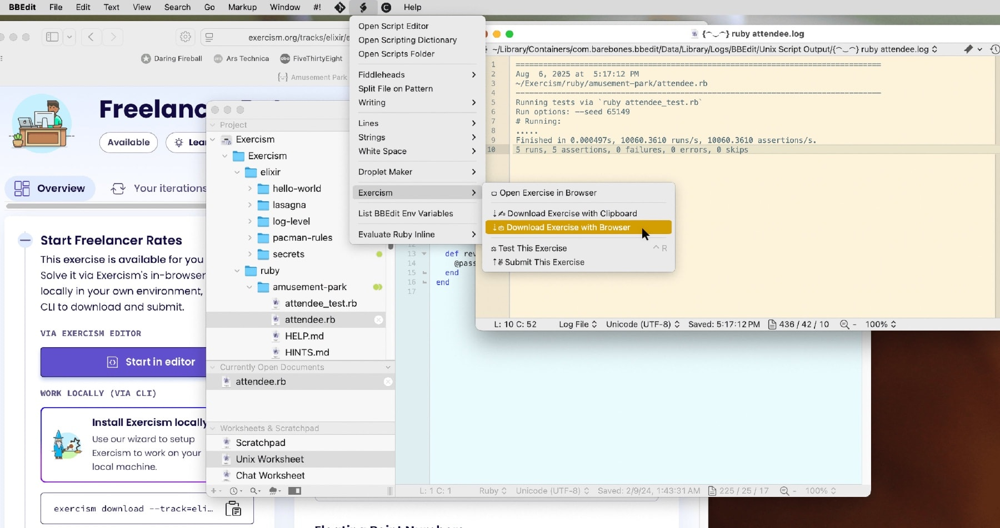
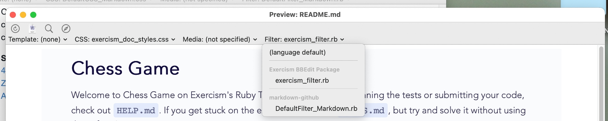

# Exercism BBEdit Package

[BBEdit](https://www.barebones.com/products/bbedit/) is a stalwart commercial text editor for the Macintosh computer.

[Exercism](https://exercism.org) is a non-profit, community driven, site for learning programming. They have tracks for 71 languages last I checked. Every track provide a wealth of exercises *-a.k.a. lessons-* for you to learn that language. You can use just their website with a built-in text editor or edit the files locally with the help of their command line tools.

This is a package to intrigate BBEdit with the Exercism website and command line tool.

I’m in no way affiliated with Bare Bones or Exercism. I just did this for fun.



## Requirements

- BBEdit, I’ve only test this on version 15.x.x but I suspect older versions will work as well.

- The Exercism [command line tools](https://exercism.org/docs/using/solving-exercises/working-locally), as of version 3.4.1.

- Ruby 2.7.4 and up.

- I developed this on MacOS Sonoma (14.x.x) and Sequoia (15.x.x).

## Installation
1. Clone the project where you like to keep projects.
	
	```
	$ cd ~/projects
	$ git clone git@github.com:CiiDub/Exercism-BBEdit-Package.git'
	```
1. Navigate to the project and run the install rake command.

	```
	$ cd Exercism-BBEdit-Package
	$ rake install
	```

This will create a BBEdit package in `'~/Library/Application Support/BBEdit/Packages'`, after which it’s commands will be available under the submenu `Exercism` in the script menu. You might need to restart BBEdit.

__Commands as They Should be Displayed__

``` 
 ⎚ Open Exercise in Browser
 
 ---
 ⇣✍︎ Download Exercise with Clipboard
 
 ⇣⎙ Download Exercise with Browser
 
 ---
 
 ⚖︎ Test This Exercise
 
 ⇡✌︎ Submit This Exercise
 ```

You may use `rake unistall` to remove this package, no harm done.

## Usage
### To Begin With

1. Sign up for an account at [Exercism](https://exercism.org). Become familiar with the website and how it works. You might want to do a couple of the exercises online before working locally.

1. Install their CLI tool. You can find instructions here: [Working locally with the Exercism CLI](https://exercism.org/docs/using/solving-exercises/working-locally).

1. Navigate to a track and exercise that you are interested in work on.

### The Commands

- `⎚ Open Exercise in Browser`

	With an exercise opened in BBEdit you can use this command to *open* that exercises page in your default browser.

- `⇣✍ Download Exercise with Clipboard`

	Every exercise have *WORK LOCALLY (VIA CLI)* and *Start in editor* sections that provides a CLI command to copy. Here’s an example.

	```
	exercism download --track=elixir --exercise=freelancer-rates
	```
	
	Rather then pasting it into you terminal, use this command and it will use your clipboard to download and open the correct exercise in BBEdit using the copied command.

- `⇣⎙ Download Exercise with Browser`

	This does the same thing as above but you don’t have to copy anything. I works with Safari, Chrome, and Brave. 
	
	If you’ve previously downloaded the exercise in question both download commands will provide you with options to just open the exercise or to overwrite it if you want a clean slate.

> [!NOTE]
> _Browser Support_: Adding support for any browser with and AppleScript library should be simple, I believe that included any Chromium browser. Firefox does not provide proper AppleScript support. I had implimented a Firefox *handler* using interface scripting. This was really hacky and created edge cases where the command would fail. So I pulled it out. After all, the *Download Exercise with Clipboard* works fine.

- `⚖︎ Test This Exercise`

	This will run an exercises’ test and present the results. I try to display the result in a BBEdit kind of way, as an open log file. I’m imitating the behavior of the `Run` command from the shebang `#!` menu.

- `⇡✌︎ Submit This Exercise`

	This will submit your solution and open the exercises’ page for you.
	
> [!TIP]
> _Custom Key Commands_: `#! > Run` has a key command set to `⌘R` by defualt in BBEdit. I set `⌃R` to envoke `⚖︎ Test This Exercise`. The easiest way to do this is with BBEdit's script pallete.

## Configuration

This package provides three setting options. They are accessible through the `rake` command. If you run `rake -T` you will see a list of all the commands available for this project, but here is are the ones related to settings.

```
rake settings:autosave_on_submit[on_off]
rake settings:autosave_on_test[on_off]
rake settings:tag_on_test[tag_name]
```

So passing “on” to the two autosave commands will save the open exercise file when you run `⇡✌︎ Submit This Exercise` and `⚖︎ Test This Exercise` respectively.

It will look like this in the terminal.

```
$ rake settings:autosave_on_submit[on]
-------------------------
Autosave on submit is on.
-------------------------

$ rake settings:autosave_on_test[on]
-----------------------
Autosave on Test is on.
-----------------------
```

Using `tag_on_test` is a little different. The tags in question are [Finder tags](https://support.apple.com/guide/mac-help/tag-files-and-folders-mchlp15236/mac) which can also be seen in BBEdit project windows file browser.

To use this feature you need to create a tag in the Finder, with a color of your choice and name it something like “Done” or “Passed”. You do this in the Finder’s settings.

Then in the terminal `rake settings:tag_on_test[Pass]`.

Now when your exercise passes it’s test it will tag it’s folder appropriately.

Passing “off” to any of these rake tasks will deactivate them.

> [!NOTE]
> _About ZSH and Rake:_ ZSH's globing behavior messes with Rake's bracket syntax for receiving arguments. I recommend adding `alias rake="noglob rake"` to your `.zprofile` or `.zshrc` file. You might also set the `NOMATCH` zsh option as the folks at [Thoughbots](https://thoughtbot.com/blog/how-to-use-arguments-in-a-rake-task) did.
> 
> Otherwise you will have to wrap all of rakes command arguments in quotes or escape globbing characters. This doesn’t effect the installation of the package but does effect the configuration commands.
> 
> __Some references about Rake, ZSH and Globbing__  
> [4 Ways to Pass Arguments to a Rake Task](https://www.seancdavis.com/posts/4-ways-to-pass-arguments-to-a-rake-task/)<br>[ZSH Globbing as an Alternative to Find Command](https://dmitry-antonyuk.medium.com/zsh-globbing-as-an-alternative-to-find-command-2ebf9da5cffe)</br>[A Guide to ZSH Expansion with Examples](https://thevaluable.dev/zsh-expansion-guide-example/)

## Bonus Feature: Exercism markdown rendering

BBEdit’s `Markup > Preview in BBEdit` command will preview the selected file, including markdown files. It works great with vanilla markdown but not so well with markdown that have unique [specifications](https://exercism.org/docs/building/markdown/markdown#h-special-blocks-sometimes-called-admonitions). It also will not render code blocks with code highlighting.

BBEdit allows you to apply unique styles and filters from the preview window. I’ve provided a filter and a style to use with Exercism style markdown, such as the ReadMe.md that provide instructions for every exercise.



- The `exercism_filter.rb` renders Exercism markdown with ‘Special Blocks’ and code highlighting.

- The `exercism_doc_styles.css` makes it look nice and similar (not exactly) to the Exercism.org website. 

### Requirements

This feature requires that you install two ruby gems. In your terminal use these commands.

1. `$ gem install redcarpet`  
	_If it’s not installed nothing will render when `exercism-filter.rb` is selected._

2. `$ gem install rouge`  
	_Only required for syntax highlighting in code blocks._


> [!TIP]
> ###### How I use BBEdit with Exercism
> 
> When you install the Exercism tools on your system it will create a folder in your home directory. It’s the Exercism workspace.
> 
> I made a BBEdit project with the workspace as it’s root.
> 
> ###### You might not want this package_
> 
> Every project has a [Unix Worksheet](https://www.barebones.com/products/bbedit/benefitsintegrate.html#worksheet). It’s a text document married with a terminal shell. Type a shell command, control return on that line, then see the results on proceeding lines.
> 
> Because it’s a text document you can leave common commands in place then just cd in to different tracks and exercises.
> 
> You might have a unix worksheet like this attached to your Exercism project.
> 
> ```
> cd ~/Exercism/ruby/darts; pwd;
> /Users/chris/Exercism/ruby/darts
> 
> exercism open
> 
> exercism submit
> 
> exercism test
> Running tests via `ruby darts_test.rb`
> 
> Run options: --seed 2115
> 
> # Running:
> 
> .............
> 
> Finished in 0.000632s, 20569.6152 runs/s, 20569.6152 assertions/s.
> 
> 13 runs, 13 assertions, 0 failures, 0 errors, 0 skips
> ```
> 
> It’s a very flexible way to work.

